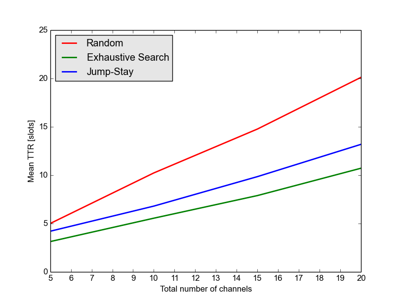

RendezvouSim
============

This is the source code of a simulation tool for benchmarking various
link establishment algorithms, a.k.a. rendezvous algorithms.
The main motivation behind creating this tool was the lack of a common
simulation platform for the various kinds of algorithms published in the recent
years. We hope this tool kind provide such a common tool.

The simulation includes following algorithms:
* Random Rendezvous
* Modular Clock and Modified Modular Clock
* Sequence Rendezvous
* Jump and Stay
* DRSEQ Rendezvous
* CRSEQ Rendezvous
* ExhaustiveSearch


##Running the simulation

For running the simulation, one can just use one of the provided examples.
The simulation results are directly written to stdout as CSVs and could be piped into an extra
file for plotting.

```
$ ./run_symmetric.py 
#alg	M	G	num_it	num_ok	num_nok	TTRmin	TTRmean	TTRmax	TTRstd	bw	acdp	theta
 random	5	5	1000	1000	0	1.00	4.99	35.00	4.60	1	0.00	1.00
ex	5	5	1000	1000	0	1.00	3.12	5.00	1.37	1	0.00	1.00
js	5	5	1000	1000	0	1.00	4.19	18.00	3.22	1	0.00	1.00
 random	10	10	1000	1000	0	1.00	10.22	91.00	10.59	1	0.00	1.00
ex	10	10	1000	1000	0	1.00	5.54	10.00	2.82	1	0.00	1.00
js	10	10	1000	1000	0	1.00	6.79	29.00	4.83	1	0.00	1.00
 random	15	15	1000	1000	0	1.00	14.76	115.00	14.39	1	0.00	1.00
ex	15	15	1000	1000	0	1.00	7.88	15.00	4.39	1	0.00	1.00
js	15	15	1000	1000	0	1.00	9.84	47.00	7.39	1	0.00	1.00
 random	20	20	1000	1000	0	1.00	20.11	178.00	19.50	1	0.00	1.00
ex	20	20	1000	1000	0	1.00	10.71	20.00	5.77	1	0.00	1.00
js	20	20	1000	1000	0	1.00	13.18	61.00	9.63	1	0.00	1.00
```

Alternativly, one can also use the basic plotting facilties provided by the simulation.

```
$ ./run_symmetric.py > example.dat
$ ./plot_results.py -x max_num_channels -y ttr -i example.dat
```

This should create something like this:


##License and Referencing

This code package is licensed under the GPLv2 license. If you in any way use this code for research that results in publications, please cite our code and/or papers.
